# 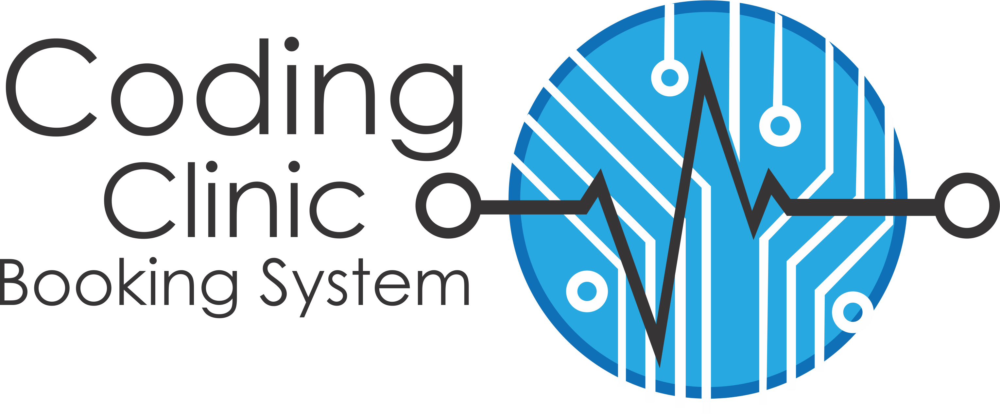

WeThinkCode-clinics are spaces where patients can get help with their code-related-ailments.  
The consultation rooms are demarcated workstations and experienced coders are virtual clinicians.  
This command-line tool helps manage appointments.

| 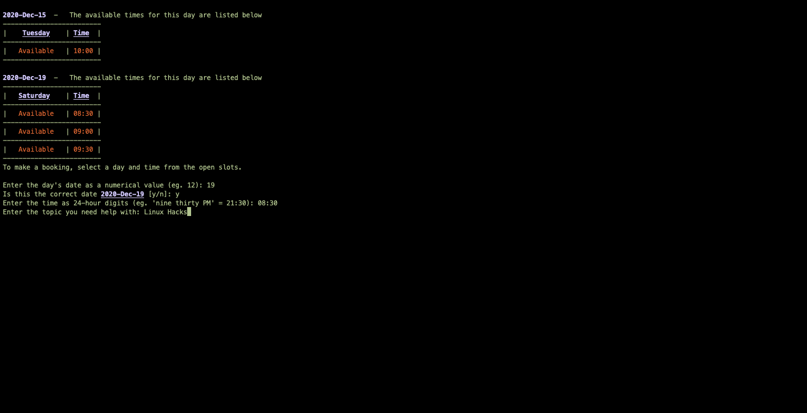 | 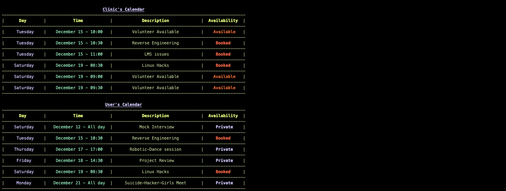 | 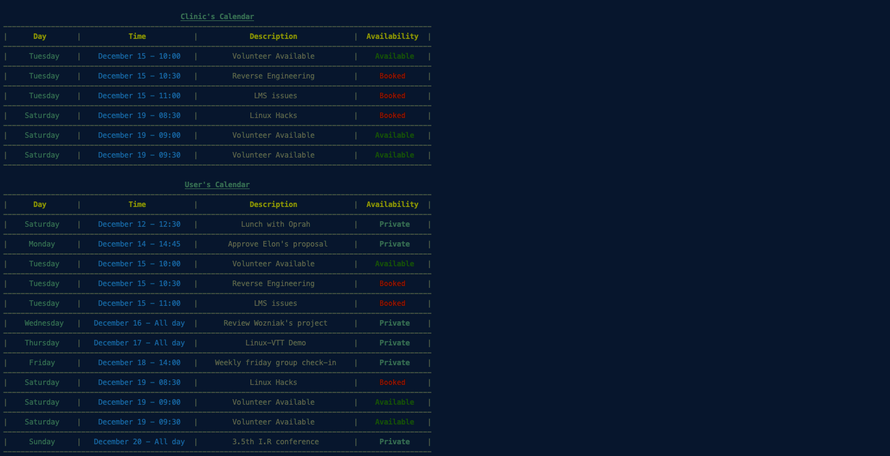 |
| :--: | :--: | :--: |
| Book for Help | See your Booking Details | Prepare to Help |  

## Contents

1. [Introduction](#introduction)

2. [Built With](#built-with)

3. [Runs On](#runs-on)

4. [To Start](#to-start)

5. [To Use](#to-use)

   * [View Calendar Events](#view-calendar-events)

   * [Make a Booking](#make-a-booking)

   * [Create an Appointment Slot](#create-an-appointment)

   * [Cancel a Booking](#cancel-a-booking)

   * [Cancel as a Volunteer](#cancel-as-a-volunteer)

6. [Features](#features)
  
   * [Options](#options)

7. [Todo](#todo)

8. [Future Fixes](#future-fixes)  

     * [Errors](#errors)

9. [To Test](#to-test)

10. [Contact](#contact)

## Introduction

In the beginning,  
students suffering from code-sores  
had to leave the comfort of their terminals...  
And schlep around their Google accounts...  
And fumble about some "schleppy spreadsheet calendar thing"...  
And schlep some more just to book a basic appointment!  

A few months later,  
the Coding Clinic Booking System is released.  
Now coders can book sessions or create appointment slots  
at the comfort of their terminals.

## Built With

* google-api-python-client

* google-auth-httplib2

* google-auth-oauthlib

* python 3.7.3

## Runs On

Most linux and macOS systems.

## To Start

| Initial run | Configure to use your personal account |
| :-- | :-- |
| 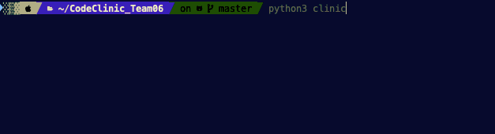 | 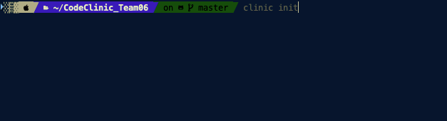 |
| **Enter your email address:** | **Enter days to download:** |
| 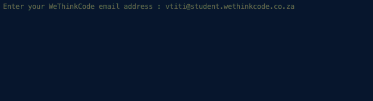 | 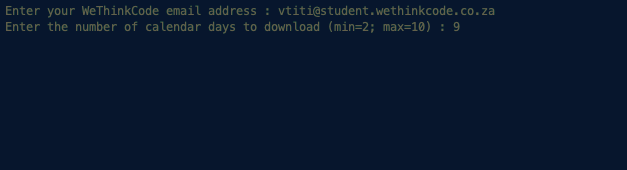 |

Your default browser will direct you to a google sign-in screen or copy and paste the authorization url into your preferred browser.
|Default | Copy | Paste |
| --- | --- | --- |
| 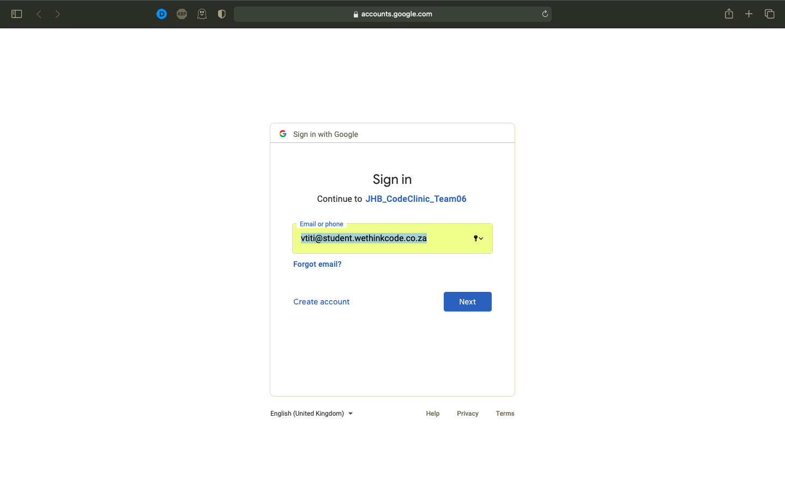 | 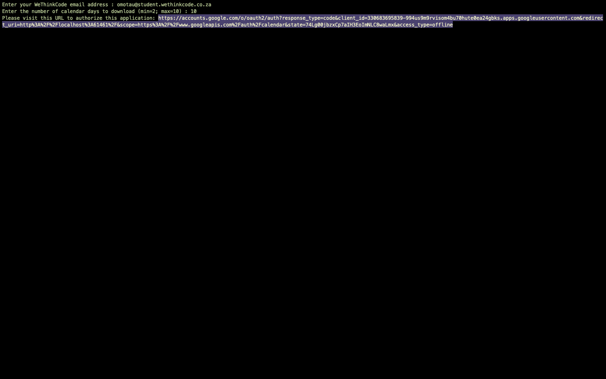 | 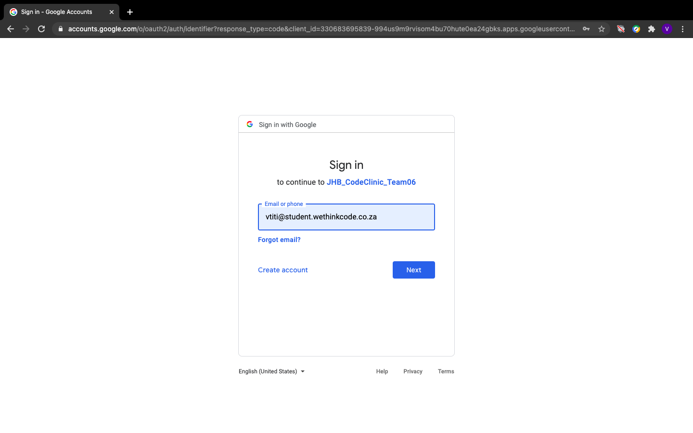 |

The Coding Clinic Booking System requires read/write permissions in order to function.
Despite Google's warnings, it poses no threat to your personal data.
|1. Click **Advanced**: | 2. Click **Go to JHB_CodeClinic_Team06(unsafe)**: | 3. Click **Allow**: |
| :-- | :-- | :-- |
|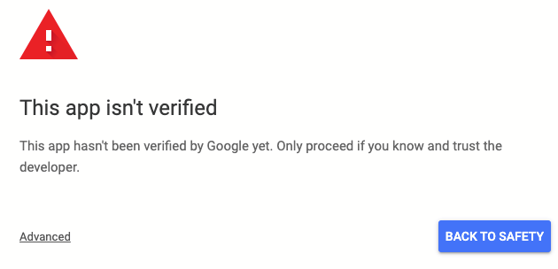 | 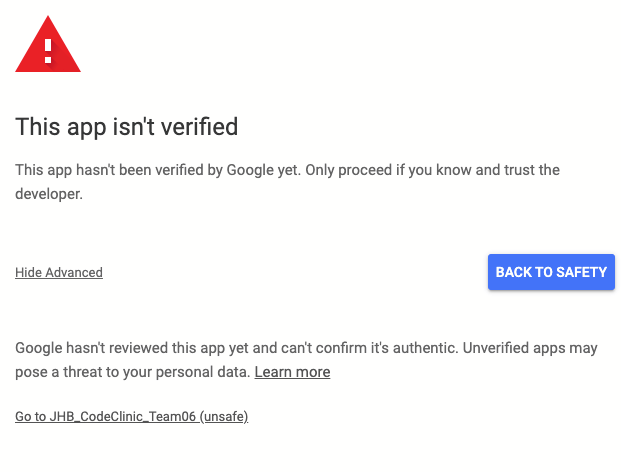 | 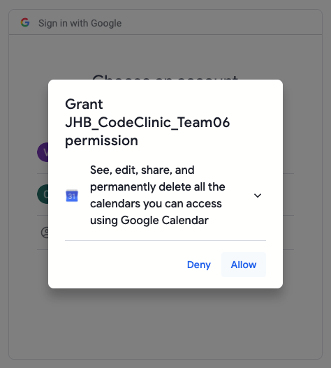 |
| **4.Click Allow:** | **5. Close browser:** |
| 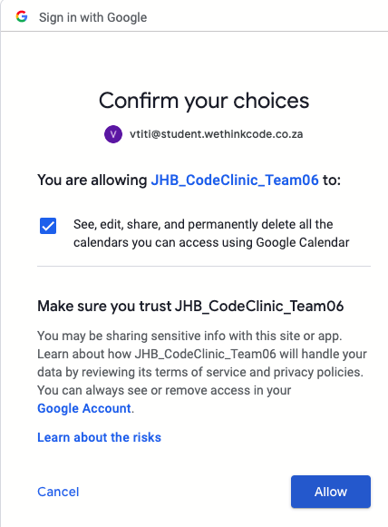 | 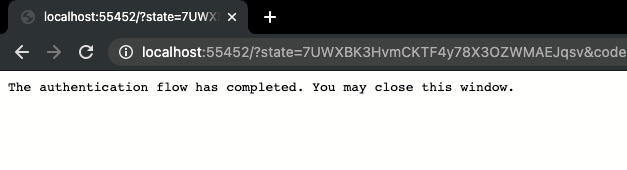 |

*Meanwhile, back at the command-line...*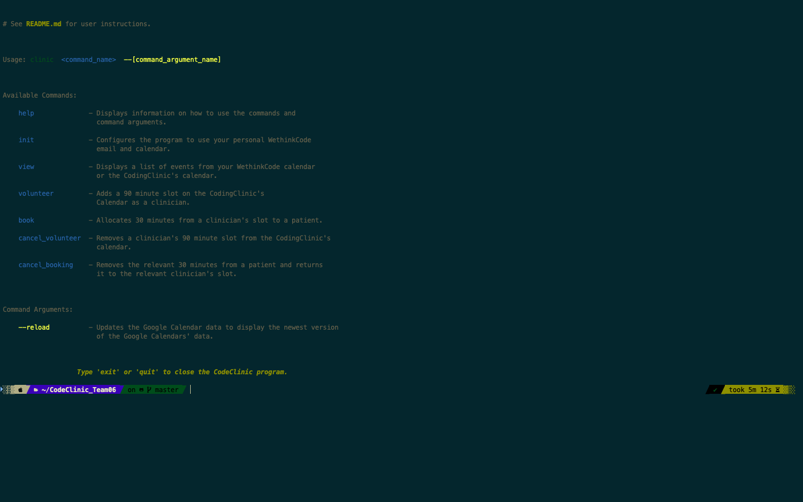

## To Use

### View Calendar Events

```sh
clinic view
```

*Note: events with no descriptions will have blank description-fields.*

| 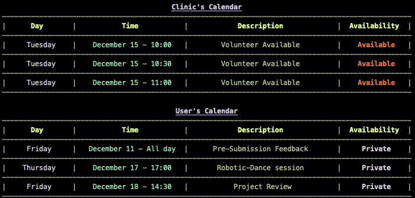 | 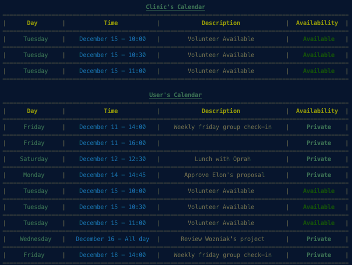 |
| :--: | :--: |
| Patient | Clinician

### Make a Booking

```sh
clinic book
```

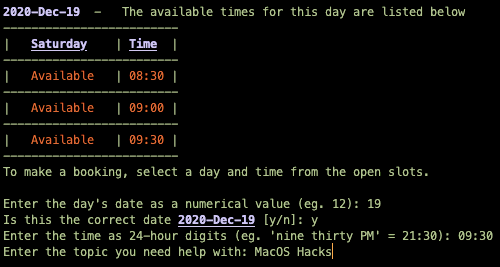*<-- Enter your booking details*

| 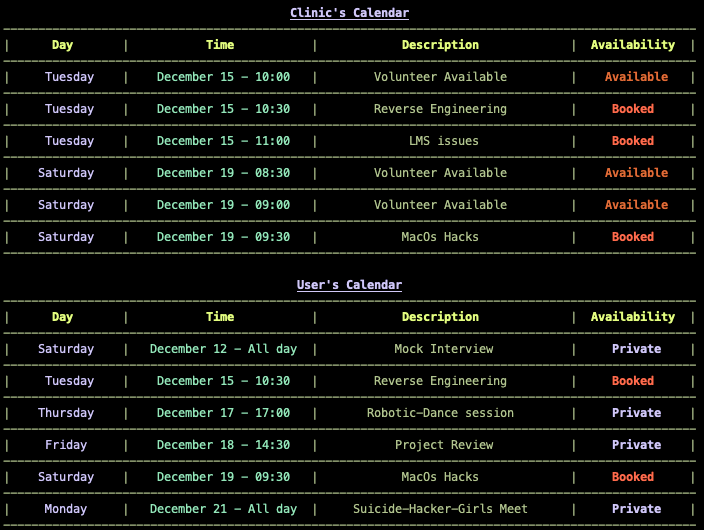 | 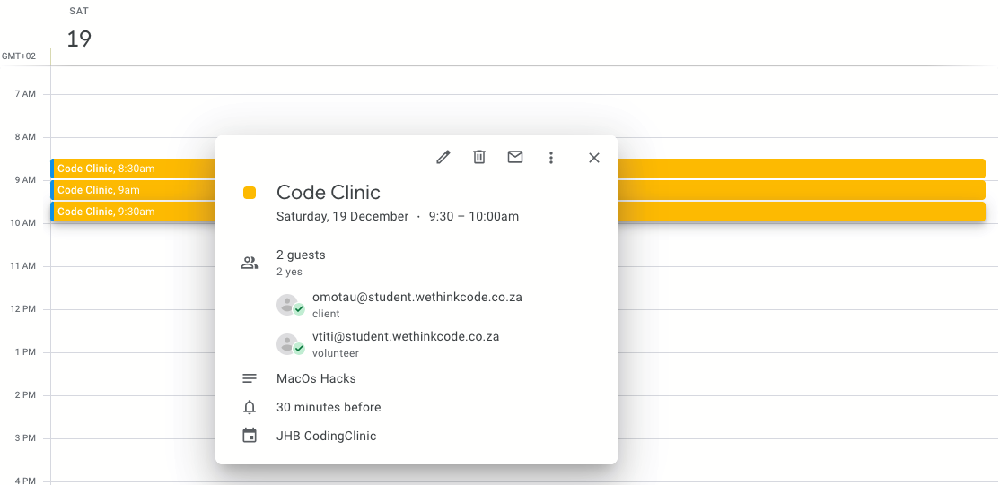 |
| :--: | :--: |
| Patient | Clinic |

### Create an Appointment Slot

```sh
clinic volunteer
```

| 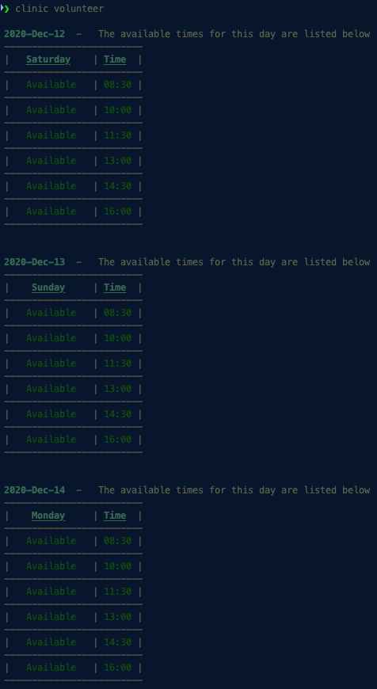 | 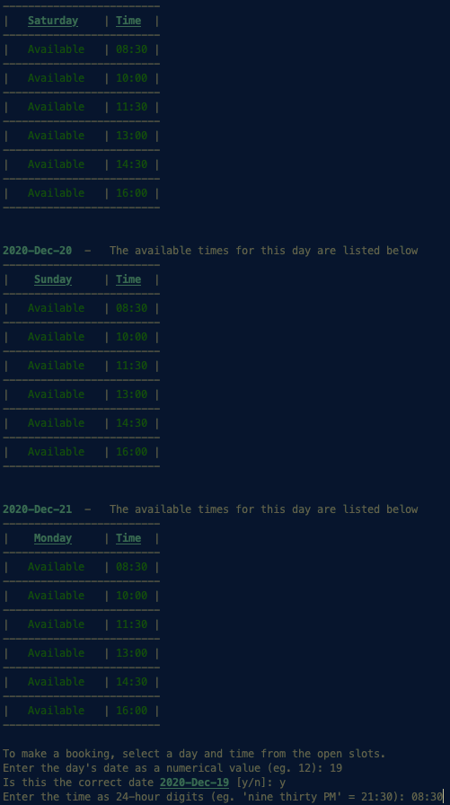 |
| :--: | :--: |
| Scrolled Up | Scrolled Down|

| 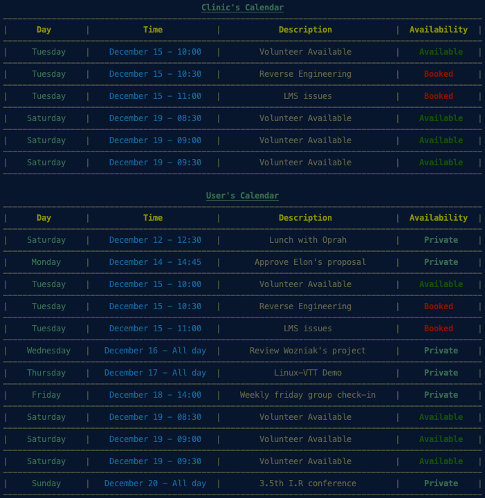 | 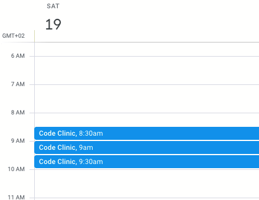 |
| :--: | :--: |
| CLI | Web |

### Cancel a Booking

```sh
clinic cancel_booking
```

| 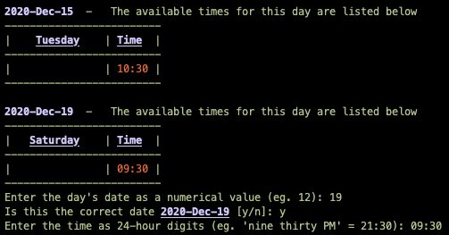 | 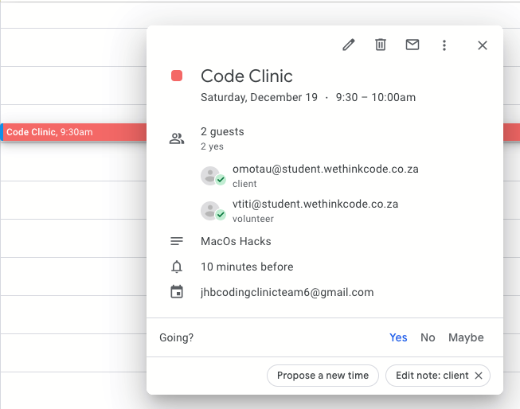 |
| :--: | :--: |
| CLI | Web |

### Cancel as a Volunteer

```sh
clinic cancel_volunteer
```

|  | 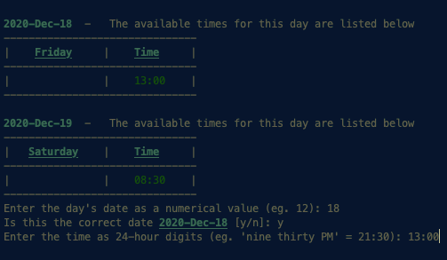 | 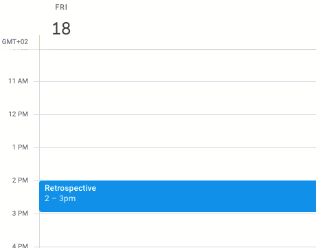 |
| :--: | :--: | :--: |
| Before | Cancellation Details | After |

## Features

* Scrollbar for viewing calendar days
* Download 2 to 10 days worth of calendar data
* Export your bookings schedule in iCal file format for offline access
* Options:  
  * use the ```—-reload``` command argument to reflect changes that occur before an access token is refreshed

## Todo

* [ ] multiple configuration files for system tools  
  
  * [ ] remove need for command line arguments that specify configuration
  
  * [ ] remove redundant ```--reload``` (5sec token-refresh intervals)

## Future Fixes

### Errors

Denying permissions during the authentication flow crashes the program on an AccessDeniedError.  

* rerun and make sure all permissions (read/write access) are granted  

Attempting to connect to www.googleapis.com without an internet connection crashes the program on a ServerNotFoundError.

* make sure you have a stable internet connection before you restart the program

## To Test

```sh
python3 -m unittest tests/<test_module_name.py>
```

## Contact

Henry Wessels  
email: hwessels@student.wethinkcode.co.za  
GitHub: <https://github.com/GingerNinja2962>

Oarabile Moima  
email: omoima@student.wethinkcode.co.za  
GitHub: <https://github.com/omoima>  

Mbongeni Sibiya  
email: msibiya@student.wethinkcode.co.za  
GitHub: <https://github.com/msibiya-jhb>

Vuyo Titi  
email: vtiti@student.wethinkcode.co.za  
GitHub: <https://github.com/vtitiJHB>

Edward Noko  
email: enoko@student.wethinkcode.co.za
